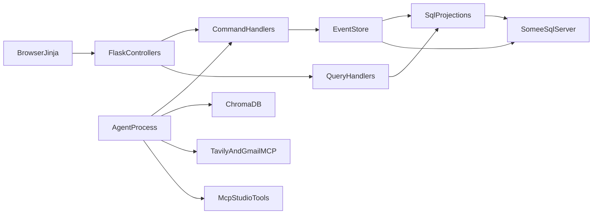

# System Architecture: KindBridge

## 1. Locked stack

| Concern | Choice | Why |
| :--- | :--- | :--- |
| Web app | Python 3.11+, Flask 3, Jinja2 + JSON APIs | Course NFR 4; MVC views + CQRS handlers |
| Relational DB | SQL Server on Somee.com | Course NFR 5/8 |
| Vector DB | ChromaDB process (persistent directory or hosted) | NFR 6; SQL Server has no pgvector |
| Embeddings | `text-embedding-3-small` (OpenAI) or local `all-MiniLM-L6-v2` fallback | Document which env var is set |
| Agent | Separate OS process, Deep Agents / LangGraph-style graph | Course NFR 11; not inside a Flask worker |
| MCP | Tavily Search, Gmail, plus two MCP-Studio tools | NFR 9–10 |
| Auth | JWT cookies | See system-spec |
| VCS | GitHub | NFR 12 |

Do not leave Chroma vs pgvector undecided in code.



---

## 2. MVC + CQRS + Event Sourcing

Course NFR 7 and 8 together:

- **MVC:** Flask blueprints = controllers. Jinja templates (and JSON serializers) = views. Domain + command/query handlers = model layer. Controllers never open SQL cursors.
- **CQRS:** mutating HTTP routes dispatch a **Command**; GET routes dispatch a **Query**. Queries never append events.
- **Event Sourcing:** every successful command appends one or more immutable events, then updates projections. Details: [event-sourcing.md](event-sourcing.md).

```text
Browser / Jinja
    -> controllers/ (Flask blueprints)
        -> commands/  -> event_store.append -> projectors/
        -> queries/   -> read SQL projections only
Background agent process
    -> poll PENDING_REVIEW / NO_MATCH retrigger
    -> MCP tools + Chroma RAG
    -> ProposeMatchCommand (same command bus)
```

### Folder layout

```text
app/
  __init__.py                 # Flask factory
  controllers/
    auth_controller.py
    requests_controller.py
    admin_controller.py
    volunteer_controller.py
  commands/
    handlers.py
    dtos.py
  queries/
    handlers.py
  projections/
    projectors.py
  repositories/               # interfaces + SQL Server impl
  views/                      # Jinja
  templates/
agent/
  main.py                     # process entry
  graph.py                    # Deep Agent graph
  tools_mcp.py
mcp_tools/                    # MCP Studio exported tools
  calculate_travel_context.py
  check_volunteer_capacity.py
tests/
docs/
.cursor/rules/
.cursor/skills/
```

---

## 3. HTTP surface (controllers)

All mutating routes: CSRF + JWT. Prefix `/`.

| Method | Path | Role | Command/Query |
| :--- | :--- | :--- | :--- |
| GET | `/login` | anon | view |
| GET | `/register` | anon | view |
| POST | `/api/auth/register` | anon | `RegisterUserCommand` |
| POST | `/api/auth/login` | anon | `LoginCommand` |
| POST | `/api/auth/logout` | any | expire cookies |
| GET | `/dashboard` | ADMIN | `GetAdminDashboardQuery` |
| GET | `/me/requests` | REQUESTER | `GetMyRequestsQuery` |
| GET | `/requests` | scoped | `SearchHelpRequestsQuery` |
| GET | `/requests/<id>` | scoped | `GetHelpRequestDetailsQuery` |
| POST | `/api/requests` | REQUESTER | `SubmitHelpRequestCommand` |
| POST | `/api/requests/<id>/cancel` | owner/ADMIN | `CancelRequestCommand` |
| POST | `/api/requests/<id>/approve` | ADMIN | `ApproveAssignmentCommand` |
| POST | `/api/requests/<id>/reject` | ADMIN | `RejectAssignmentCommand` |
| POST | `/api/requests/<id>/override` | ADMIN | `OverrideAssignmentCommand` |
| POST | `/api/requests/<id>/retrigger` | ADMIN | `RetriggerMatchCommand` |
| GET | `/me/tasks` | VOLUNTEER | `GetVolunteerTasksQuery` |
| POST | `/api/assignments/<id>/complete` | assigned volunteer | `CompleteTaskCommand` |
| POST | `/api/assignments/<id>/release` | assigned volunteer | `ReleaseTaskCommand` |
| POST | `/api/profile` | VOLUNTEER | `UpdateVolunteerProfileCommand` |
| POST | `/api/profile/availability` | VOLUNTEER | `SetVolunteerAvailabilityCommand` |
| POST | `/api/exemptions` | ADMIN or volunteer | `CreateExemptionLinkCommand` |

Agent does not call HTTP; it imports the command bus in-process or via a loopback that still goes through the handler (same invariants).

---

## 4. Deployment topology

Three processes:

1. **Flask** (Waitress/gunicorn-equivalent on Windows/Somee as required) — HTTP.
2. **KindBridge agent** — `python -m agent.main`, poll interval **15 seconds**, `SELECT` requests in `PENDING_REVIEW` where `match_attempt` is stale or zero.
3. **Chroma** — embedded in the agent process with on-disk persistence, or a sidecar.

SQL Server is remote (Somee). Secrets only in environment: `DATABASE_URL`, `JWT_SECRET`, `OPENAI_API_KEY`, `TAVILY_API_KEY`, `GMAIL_MCP_*`, `ADMIN_BOOTSTRAP_EMAIL`.

### Failure policy

| Failure | Behavior |
| :--- | :--- |
| Tavily timeout/error | Continue scoring with travel tool + RAG only; rationale notes `web_lookup=skipped`; do not fail the whole match |
| No eligible volunteers | `NoMatchFound` → `NO_MATCH` |
| Embedding API down | Retry 3× exponential backoff; leave ticket `PENDING_REVIEW`; log `embedding_failed` |
| Gmail MCP down | Assignment still commits; enqueue `NotificationPending` projection for retry |
| Agent crash mid-batch | Idempotency key `(request_id, match_attempt)`; duplicate Propose is a no-op |

---

## 5. Command and query lists

See [system-spec.md](system-spec.md) section 5. Handlers live under `app/commands` and `app/queries`.

Agent-specific design: [agent-and-mcp.md](agent-and-mcp.md).
