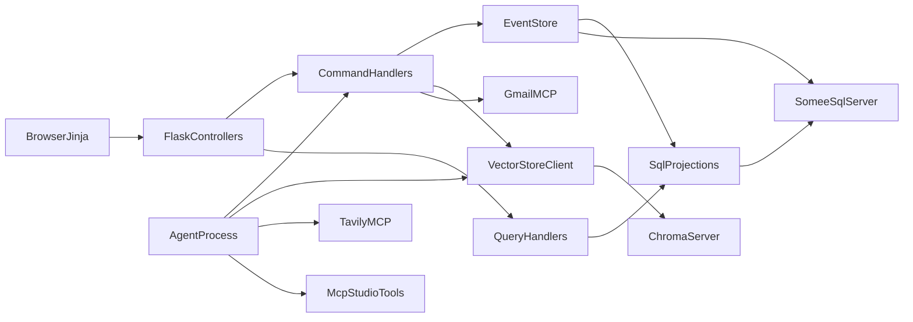

# System Architecture: KindBridge

## 1. Locked stack

| Concern | Choice | Why |
| :--- | :--- | :--- |
| Web app | Python 3.11+, Flask 3, Jinja2 + JSON APIs | Course NFR 4; MVC views + CQRS handlers |
| Relational DB | SQL Server on Somee.com | Course NFR 5/8 |
| Vector DB | ChromaDB running as a **server (sidecar)**; clients connect over HTTP | NFR 6; SQL Server has no pgvector |
| Embeddings | `text-embedding-3-small` (OpenAI) or local `all-MiniLM-L6-v2` fallback | Document which env var is set |
| Agent | Separate OS process, Deep Agents / LangGraph-style graph | Course NFR 11; not inside a Flask worker |
| LLM | Ollama (Docker) or OpenAI via `LLM_PROVIDER` / `LLM_MODEL` | Course NFR 11; limited role, see agent-and-mcp.md 2.1 |
| MCP | Tavily Search, Gmail, plus two MCP-Studio tools | NFR 9-10 |
| Auth | JWT cookies | See system-spec |
| VCS | GitHub | NFR 12 |

Do not leave Chroma vs pgvector undecided in code. The decision is Chroma.



---

## 2. MVC + CQRS + Event Sourcing

Course NFR 7 and 8 together:

- **MVC:** Flask blueprints in `controllers/` = controllers. Jinja templates in `templates/` = views. `domain/` + command/query handlers = model layer. Controllers never open SQL cursors.
- **CQRS:** mutating HTTP routes dispatch a **Command** through the command bus; GET routes dispatch a **Query**. Queries never append events.
- **Event Sourcing:** every successful command appends one or more immutable events, then updates projections. Details: [event-sourcing.md](event-sourcing.md).

```text
Browser / Jinja
    -> controllers/ (Flask blueprints)
        -> commands/bus.py -> command handler
              -> domain/ aggregate decides
              -> repositories/event_store.append -> projections/projectors
        -> queries/        -> read SQL projections only
Background agent process
    -> poll requests with status = PENDING_REVIEW
    -> MCP tools + Chroma RAG (via infrastructure/vector_store.py)
    -> ProposeMatchCommand (same command bus)
```

### Layer responsibilities

| Layer | Responsibility | Must not |
| :--- | :--- | :--- |
| `controllers/` | Parse HTTP, check JWT/CSRF/role, call bus or query, render template or JSON | Open SQL cursors, contain business rules |
| `commands/` | One handler per command; load aggregate, call domain, append events; run post-commit side effects (Chroma upsert/delete, Gmail) | Read from projections for decisions that belong to the aggregate |
| `queries/` | Read-only access to SQL projections | Append to `event_store`, mutate any table |
| `domain/` | Aggregates, event classes, domain errors, invariants | Import Flask, SQL, or Chroma |
| `projections/` | Update read-model tables from events; rebuild | Contain decision logic |
| `repositories/` | Event store and SQL repositories behind interfaces | Leak SQL outside this layer |
| `infrastructure/` | Chroma client and embeddings, shared by Flask and agent | Hold business rules |
| `security/` | JWT, CSRF, bcrypt helpers | Touch the database |

### Folder layout

```text
app/
  __init__.py                 # Flask factory
  config.py                   # reads environment variables
  controllers/                # Flask blueprints (MVC controllers)
    auth_controller.py
    requests_controller.py
    admin_controller.py
    volunteer_controller.py
  commands/                   # CQRS write side
    bus.py                    # command bus (used by Flask and the agent)
    dtos.py
    user_commands.py
    request_commands.py
    volunteer_commands.py
  queries/                    # CQRS read side
    request_queries.py
    admin_queries.py
    volunteer_queries.py
  domain/                     # model layer
    aggregates.py
    events.py
    errors.py
  projections/
    projectors.py
    rebuild.py                # python -m app.projections.rebuild
  repositories/               # interfaces + SQL Server implementation
    event_store.py
  infrastructure/             # shared by Flask and agent
    vector_store.py           # Chroma client (HTTP)
    embeddings.py
  security/                   # JWT, CSRF, bcrypt
  templates/                  # Jinja views
  static/
agent/
  __init__.py
  main.py                     # process entry: python -m agent.main
  graph.py                    # Deep Agent graph
  tools_mcp.py
mcp_tools/                    # MCP Studio exported tools
  __init__.py
  calculate_travel_context.py
  check_volunteer_capacity.py
db/
  schema.sql                  # create event_store + projections; does not drop
  reset_local.sql             # local wipe, including event_store
  seed.py                     # first admin + demo data
tests/
docs/
.cursor/
  rules/                      # kindbridge-cqrs.mdc
  skills/                     # volunteer-semantic-matching/SKILL.md
requirements.txt
.env.example
.gitignore
```

Every Python package directory contains an `__init__.py`.

---

## 3. HTTP surface (controllers)

All mutating routes: CSRF + JWT. Prefix `/`.

| Method | Path | Role | Command/Query |
| :--- | :--- | :--- | :--- |
| GET | `/` | anon | redirect to `/login`; authenticated users go to `/me` |
| GET | `/login` | anon | view |
| GET | `/register` | anon | view |
| POST | `/api/auth/register` | anon | `RegisterUserCommand` |
| POST | `/api/auth/login` | anon | `LoginCommand` |
| POST | `/api/auth/logout` | any | expire cookies, rotate CSRF token |
| GET | `/api/auth/csrf` | anon | returns the double-submit CSRF token (also set as `kb_csrf` cookie on any response) |
| GET | `/api/auth/me` | any authenticated | current `user_id` and `roles` from the JWT |
| GET | `/me` | any authenticated | account page; `GetMyAccountQuery` |
| GET | `/api/me/account` | any authenticated | `GetMyAccountQuery` |
| POST | `/api/me/account` | any authenticated | `UpdateAccountDetailsCommand` (email cannot change) |
| GET | `/me/requester` | non-admin | requester enrollment view; redirects to `/me/requests` when a requester profile exists |
| POST | `/api/me/requester` | non-admin | `UpdateRequesterProfileCommand` |
| GET | `/me/volunteer` | non-admin | add-volunteering form, also used to update availability. Vehicle, free text, frequency, and unavailability periods. No city field |
| POST | `/api/me/volunteer` | non-admin | `EnableVolunteerProfileCommand` |
| GET | `/dashboard` | ADMIN | `GetAdminDashboardQuery` |
| GET | `/me/requests` | non-admin with a requester profile | own-ticket table; otherwise redirect to `/me/requester` |
| GET | `/me/requests/new` | non-admin with a requester profile | create-request form; otherwise redirect to `/me/requester` |
| GET | `/api/me/requests` | REQUESTER | `GetMyRequestsQuery` (status, category, urgency, city; status defaults to open) |
| GET | `/requests` | scoped | `SearchHelpRequestsQuery` |
| GET | `/requests/<id>` | scoped | `GetHelpRequestDetailsQuery` |
| POST | `/api/requests` | REQUESTER with a requester profile | `SubmitHelpRequestCommand` |
| POST | `/api/requests/<id>/cancel` | owner/ADMIN | `CancelRequestCommand` |

There is no request-update route. Replacing a ticket means cancel, then submit a new one.

### 3.1 Help-request vocabulary

`category` is a closed list: `errands`, `transport`, `shopping`, `companionship`, `home_help`, `childcare`, `tutoring`, `translation`, `first_aid`.

`resource_type`: `PHYSICAL_PRESENCE`, `EQUIPMENT_LOAN`, `FLEXIBLE_REMOTE`.

`urgency`: `LOW`, `NORMAL`, `HIGH`, `EMERGENCY`.

`required_skills` uses the same Hebrew/English skill vocabulary as volunteer résumés (`app/domain/bilingual.py`). Values are stored as that vocabulary's canonical key.
| POST | `/api/requests/<id>/approve` | ADMIN | `ApproveAssignmentCommand` |
| POST | `/api/requests/<id>/reject` | ADMIN | `RejectAssignmentCommand` |
| POST | `/api/requests/<id>/override` | ADMIN | `OverrideAssignmentCommand` |
| POST | `/api/requests/<id>/retrigger` | ADMIN | `RetriggerMatchCommand` |
| GET | `/me/tasks` | non-admin | Volunteer area. Opens with or without a volunteer profile. `GetVolunteerTasksQuery` for the caller's own `ASSIGNED` and `COMPLETED` tasks (filter `status`, `page`) in the "took on" column. `GetMyProfilesQuery` fills the "want to do" column. Header always links to `/me/volunteer` ("Add new volunteering"). Assigned rows offer Complete and Release |
| GET | `/api/me/tasks` | VOLUNTEER | same query as JSON. Address and phone are returned only for `ASSIGNED` tasks, otherwise `null` |
| GET | `/me/profile` | non-admin | redirects to `/me/volunteer` |
| GET | `/api/me/profile` | VOLUNTEER | `GetMyProfilesQuery` as JSON, including open unavailability periods |
| POST | `/api/assignments/<id>/complete` | assigned volunteer | `CompleteTaskCommand` |
| POST | `/api/assignments/<id>/release` | assigned volunteer | `ReleaseTaskCommand` |
| POST | `/api/profile` | VOLUNTEER | `UpdateVolunteerProfileCommand` (includes the `INACTIVE` toggle) |
| POST | `/api/me/skills` | VOLUNTEER | `UpdateVolunteerSkillsCommand`. Replaces the skill list and leaves the other résumé fields as they are. At least one skill is required |
| POST | `/api/me/unavailability` | VOLUNTEER | `AddVolunteerUnavailabilityCommand` |
| POST | `/api/me/unavailability/<id>/cancel` | VOLUNTEER | `CancelVolunteerUnavailabilityCommand` |
| POST | `/api/exemptions` | ADMIN or volunteer | `CreateExemptionLinkCommand` |

There is no `SetVolunteerAvailabilityCommand`. `INACTIVE` is a field of `UpdateVolunteerProfileCommand`. Date ranges use `AddVolunteerUnavailabilityCommand` and `CancelVolunteerUnavailabilityCommand` (system-spec section 5).

The agent does not call HTTP; it imports the command bus in-process (or via a loopback that still goes through the handler), so the same invariants apply.

---

## 4. Deployment topology

Three processes:

1. **Flask** (Waitress/gunicorn-equivalent on Windows/Somee as required): HTTP.
2. **KindBridge agent**: `python -m agent.main`, poll interval **15 seconds**, `SELECT` requests with `status = 'PENDING_REVIEW'` (see [agent-and-mcp.md](agent-and-mcp.md) section 1).
3. **Chroma**: runs as a sidecar server (`chroma run --path ./chroma_data`). Both Flask (upsert on profile update) and the agent (query) connect to it as clients through `app/infrastructure/vector_store.py`. Never let two processes write to the same local Chroma directory.

SQL Server is remote (Somee). Secrets only in environment: `DATABASE_URL`, `JWT_SECRET`, `OPENAI_API_KEY`, `TAVILY_API_KEY`, `GMAIL_MCP_*`, `CHROMA_HOST`, `CHROMA_PORT`, `LLM_PROVIDER`, `LLM_MODEL`, `OLLAMA_BASE_URL`, `ADMIN_BOOTSTRAP_EMAIL`. Provide `.env.example` without real values; `.env` and `chroma_data/` are in `.gitignore`.

### Failure policy

| Failure | Behavior |
| :--- | :--- |
| Tavily timeout/error | Continue scoring with travel tool + RAG only; rationale notes `web_lookup=skipped`; do not fail the whole match |
| No eligible volunteers | `NoMatchFound` -> `NO_MATCH` |
| Embedding API down | Retry 3x exponential backoff; leave ticket `PENDING_REVIEW`; log `embedding_failed` |
| Chroma server down | Profile save still commits the event; vector upsert is retried; agent leaves ticket `PENDING_REVIEW` and logs `vector_store_unavailable` |
| Gmail MCP down | Assignment still commits. The notifier retries 3 times (10 s timeout each, backoff), then logs `notify_failed` and returns. There is no durable retry queue in v1 |
| Agent crash mid-batch | Idempotency key `(request_id, match_attempt)`; duplicate Propose is a no-op |

---

## 5. Command and query lists

See [system-spec.md](system-spec.md) section 5. Handlers live under `app/commands` (one file per aggregate) and `app/queries`.

Agent-specific design: [agent-and-mcp.md](agent-and-mcp.md).