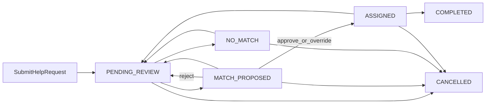

# Product & System Specification: KindBridge

Course mapping: a civic-aid request is the “open job”; proposed/assigned volunteers are the “registrants” on the dashboard (functional requirement 4.4).

## 1. Overview and objectives

KindBridge coordinates citizen assistance requests, volunteer capacity, and AI-assisted matching. A background Deep Agent evaluates records; a human dispatcher always approves, rejects, or overrides (HITL). The agent never assigns contact details or locks a volunteer by itself.

### Locked product decisions

- Product name: **KindBridge** (not AidSync).
- Matching: **top-K = 3** proposed volunteers per request, then dispatcher picks one.
- Volunteer consent after assignment: volunteer may **release** (cannot perform); there is no separate pre-accept step in v1.
- Dual role: one account has exactly one role (`REQUESTER` | `VOLUNTEER` | `ADMIN`). A volunteer cannot be assigned to a request they created (blocked if they somehow share identity).
- Relational dialect: **Microsoft SQL Server** on Somee.com. Vector store is **ChromaDB**, not pgvector.

### Primary objectives

- Track the full lifecycle of a help request.
- Semantic candidate evaluation (embeddings + RAG) plus hard constraints.
- Admin dashboard: open requests by status, candidate count per request, volunteer capacity gauges.
- Enforce inactivity, logistical capacity, schedule overlap, and mutual exemptions.

---

## 2. Authentication and identity

- **Mechanism:** JWT in HttpOnly, Secure, SameSite=Lax cookies. Access token TTL 15 minutes; refresh token TTL 7 days (rotating). CSRF: double-submit cookie on mutating POST/PUT/PATCH/DELETE.
- **Password:** bcrypt (cost ≥ 12). Minimum 10 characters. No plaintext logs.
- **RBAC:** every command and query checks `role` from JWT claims. Unauthorized → 401; forbidden → 403.
- **Bootstrap:** first admin is created by a one-time seed (`ADMIN_BOOTSTRAP_EMAIL` in environment), not via public registration.
- **Forgot-password:** out of scope for v1. Failed login lockout: 5 attempts / 15 minutes per email.

### Personas

| Role | Registration | Can do | Cannot do |
| :--- | :--- | :--- | :--- |
| Requester | Public form, role fixed | Create/cancel own requests; search/filter/detail **own** tickets | See volunteer phone/address until `ASSIGNED`; see other requesters’ tickets |
| Volunteer | Public form + profile (skills, experience résumé, availability) | Edit own profile; see **assigned** tasks; complete or release | See other volunteers; see full address until assigned |
| Admin / dispatcher | Seed only | Dashboard, search all, approve/reject/override, retrigger match, manage exemptions | Impersonate login |

---

## 3. Core entities (SQL Server projections)

Source of truth for domain changes is the **event store** (see [event-sourcing.md](event-sourcing.md)). Tables below are **read models** rebuilt from events. Types are T-SQL.

Skills are stored as `NVARCHAR(MAX)` JSON arrays (`["first_aid","driving"]`), not PostgreSQL `TEXT[]`.

### 3.1 `users`

| Field | Type | Constraints | Description |
| :--- | :--- | :--- | :--- |
| `id` | UNIQUEIDENTIFIER | PK | User id |
| `email` | NVARCHAR(255) | UNIQUE, NOT NULL | Login identifier (normalized lower-case) |
| `password_hash` | NVARCHAR(255) | NOT NULL | bcrypt hash |
| `full_name` | NVARCHAR(200) | NOT NULL | Display name |
| `phone` | NVARCHAR(30) | NOT NULL | Encrypted at rest (app-level) |
| `role` | NVARCHAR(20) | NOT NULL | `REQUESTER`, `VOLUNTEER`, `ADMIN` |
| `is_active` | BIT | NOT NULL, default 1 | Soft disable |
| `created_at` | DATETIME2 | NOT NULL | UTC |

### 3.2 `help_requests`

| Field | Type | Constraints | Description |
| :--- | :--- | :--- | :--- |
| `id` | UNIQUEIDENTIFIER | PK | Ticket id |
| `requester_id` | UNIQUEIDENTIFIER | FK users, NOT NULL | Owner |
| `city` | NVARCHAR(100) | Indexed, NOT NULL | Municipality |
| `address` | NVARCHAR(255) | NOT NULL | Street address; hidden from volunteer until assignment |
| `category` | NVARCHAR(50) | NOT NULL | Aid domain (enum in app) |
| `resource_type` | NVARCHAR(30) | NOT NULL | `PHYSICAL_PRESENCE`, `EQUIPMENT_LOAN`, `FLEXIBLE_REMOTE` |
| `description` | NVARCHAR(MAX) | NOT NULL | Narrative of need |
| `urgency` | NVARCHAR(20) | NOT NULL | `LOW`, `NORMAL`, `HIGH`, `EMERGENCY` |
| `preferred_date` | DATE | NULL | Target date |
| `preferred_time_from` | TIME | NULL | Window start |
| `preferred_time_to` | TIME | NULL | Window end |
| `estimated_duration_min` | INT | NULL | Duration minutes |
| `required_skills_json` | NVARCHAR(MAX) | NOT NULL | JSON string array |
| `requires_vehicle` | BIT | NOT NULL, default 0 | True only if transport is required; independent of `resource_type` |
| `status` | NVARCHAR(30) | Indexed, NOT NULL | See request state machine |
| `match_attempt` | INT | NOT NULL, default 0 | Incremented each ProposeMatch; used for idempotency |
| `created_at` | DATETIME2 | NOT NULL | UTC |

`requires_vehicle` is the vehicle flag. `resource_type` is how the work is delivered (on-site vs remote vs equipment). Do not duplicate `EQUIPMENT_VEHICLE`.

### 3.3 `volunteer_profiles`

`experience` + `skills_json` are the **résumé document** embedded into ChromaDB (NFR 6). Re-embed on every successful `UpdateVolunteerProfileCommand`.

| Field | Type | Constraints | Description |
| :--- | :--- | :--- | :--- |
| `id` | UNIQUEIDENTIFIER | PK | Profile id |
| `user_id` | UNIQUEIDENTIFIER | UNIQUE FK users | 1:1 with volunteer user |
| `primary_city` | NVARCHAR(100) | Indexed, NOT NULL | Home municipality |
| `has_vehicle` | BIT | NOT NULL, default 0 | Transport available |
| `skills_json` | NVARCHAR(MAX) | NOT NULL | JSON string array |
| `experience` | NVARCHAR(MAX) | NOT NULL | Résumé narrative |
| `base_frequency` | NVARCHAR(30) | NOT NULL | `WEEKLY`, `BIWEEKLY`, `MONTHLY`, `ON_DEMAND` — used as a **soft** score bonus, never a hard filter |
| `availability_status` | NVARCHAR(30) | NOT NULL, default `AVAILABLE` | See availability rules |
| `unavailable_until` | DATETIME2 | NULL | Skip until this UTC instant |
| `max_active_tasks` | INT | NOT NULL, default 1 | Concurrency cap |
| `current_active_tasks` | INT | NOT NULL, default 0 | **Projection** of ASSIGNED minus Complete/Release/Cancel; never written by a query |

**Availability rules**

- `TEMPORARILY_UNAVAILABLE`: set by volunteer with `unavailable_until`. A Flask APScheduler job (or agent poll) sets status back to `AVAILABLE` when `now > unavailable_until`.
- `BUSY`: projection — `current_active_tasks >= max_active_tasks`.
- `INACTIVE`: volunteer toggles, or 90 days with no profile update and no completed task. Agent skips `INACTIVE`.
- Agent also skips if `has_vehicle = 0` and request `requires_vehicle = 1`.

### 3.4 `task_assignments`

Multiple rows per request (up to K proposals). At most **one** row in `ASSIGNED` or `COMPLETED` per request.

| Field | Type | Constraints | Description |
| :--- | :--- | :--- | :--- |
| `id` | UNIQUEIDENTIFIER | PK | Assignment id |
| `request_id` | UNIQUEIDENTIFIER | FK help_requests | Parent ticket |
| `volunteer_id` | UNIQUEIDENTIFIER | FK volunteer_profiles | Candidate |
| `ai_score` | DECIMAL(5,2) | 0.00–100.00 | KindBridge score |
| `ai_rationale` | NVARCHAR(500) | NOT NULL | Short justification |
| `rank_in_batch` | INT | NOT NULL | 1..K in this match_attempt |
| `match_attempt` | INT | NOT NULL | Ties to request.match_attempt |
| `approved_by` | UNIQUEIDENTIFIER | NULL, FK users | Dispatcher |
| `status` | NVARCHAR(30) | NOT NULL | `PROPOSED`, `ASSIGNED`, `DECLINED`, `COMPLETED`, `SUPERSEDED` |
| `decline_reason` | NVARCHAR(500) | NULL | Reject, release, or override leftover |
| `override_reason` | NVARCHAR(500) | NULL | Required on override |
| `updated_at` | DATETIME2 | NOT NULL | UTC |

### 3.5 `exemption_links`

| Field | Type | Constraints | Description |
| :--- | :--- | :--- | :--- |
| `volunteer_id` | UNIQUEIDENTIFIER | Composite PK, FK | Excluded volunteer |
| `requester_id` | UNIQUEIDENTIFIER | Composite PK, FK | Requester |
| `created_by` | UNIQUEIDENTIFIER | FK users, NOT NULL | Admin or volunteer |
| `reason` | NVARCHAR(300) | NOT NULL | Why |
| `created_at` | DATETIME2 | NOT NULL | UTC |

Permanent for v1 (no undelete UI). Creating a link while an assignment is `ASSIGNED` is rejected; cancel or release first.

---

## 4. State machines

### 4.1 Help request status

`PENDING_REVIEW` → `MATCH_PROPOSED` | `NO_MATCH` → `ASSIGNED` → `COMPLETED`  
Any of `PENDING_REVIEW`, `MATCH_PROPOSED`, `NO_MATCH`, `ASSIGNED` → `CANCELLED`.

| Current | Command | Event | Next | Invariants |
| :--- | :--- | :--- | :--- | :--- |
| — | `RegisterUserCommand` | `UserRegistered` | (user exists) | Role immutable after create |
| — | `LoginCommand` | `UserLoggedIn` | — | Audit only; no domain status |
| — | `SubmitHelpRequestCommand` | `HelpRequestCreated` | `PENDING_REVIEW` | Requester only; enqueue agent |
| `PENDING_REVIEW` or `NO_MATCH` | `ProposeMatchCommand` | `MatchesProposed` | `MATCH_PROPOSED` | Agent only; writes 1..K `PROPOSED` rows; increments `match_attempt`; **excludes** volunteers `DECLINED` on this request and all `ExemptionLink` pairs. `SUPERSEDED` rows are leftover proposals, not a blacklist |
| `PENDING_REVIEW` or retry | `ProposeMatchCommand` (empty pool) | `NoMatchFound` | `NO_MATCH` | Admin notified; no assignment rows |
| `NO_MATCH` or `MATCH_PROPOSED` | `RetriggerMatchCommand` | `MatchRetriggered` | `PENDING_REVIEW` | Admin; previous `PROPOSED` → `SUPERSEDED` |
| `MATCH_PROPOSED` | `ApproveAssignmentCommand` | `AssignmentApproved` | `ASSIGNED` | Admin; chosen assignment → `ASSIGNED`; sibling `PROPOSED` → `SUPERSEDED`; increment volunteer active count; Gmail notify volunteer; expose address/phone to that volunteer only |
| `MATCH_PROPOSED` | `RejectAssignmentCommand` | `AssignmentsRejected` | `PENDING_REVIEW` | Admin; **all** current `PROPOSED` → `DECLINED` with reason; those volunteer ids blacklisted for **this request only**; re-queue agent |
| `MATCH_PROPOSED` | `OverrideAssignmentCommand` | `AssignmentOverridden` | `ASSIGNED` | Admin picks a volunteer **not** in the proposed set (or any eligible); `override_reason` required; current `PROPOSED` → `SUPERSEDED`; capacity + notify |
| `ASSIGNED` | `CompleteTaskCommand` | `TaskCompleted` | `COMPLETED` | Assigned volunteer only; decrement capacity; request terminal |
| `ASSIGNED` | `ReleaseTaskCommand` | `TaskReleased` | `PENDING_REVIEW` | Assigned volunteer; assignment → `DECLINED`; volunteer blacklisted on this request; decrement capacity; re-queue |
| Open states | `CancelRequestCommand` | `HelpRequestCancelled` | `CANCELLED` | Owner requester (or admin); if `ASSIGNED`, notify volunteer via Gmail and free capacity; open proposals → `SUPERSEDED` |

**Concurrency:** optimistic version on the request aggregate (`match_attempt` + event stream version). Second approve/override fails with 409.

**Past `preferred_date`:** still matchable; agent adds a score penalty; dashboard badge `OVERDUE`. `EMERGENCY` uses a higher urgency weight (see [agent-and-mcp.md](agent-and-mcp.md)), not a separate queue.

### 4.2 Assignment status

`PROPOSED` → `ASSIGNED` | `DECLINED` | `SUPERSEDED`  
`ASSIGNED` → `COMPLETED` | `DECLINED` (on release/cancel)

---

## 5. Commands and queries (complete list)

**Commands:** `RegisterUserCommand`, `LoginCommand`, `UpdateVolunteerProfileCommand`, `SetVolunteerAvailabilityCommand`, `SubmitHelpRequestCommand`, `ProposeMatchCommand` (agent), `RetriggerMatchCommand`, `ApproveAssignmentCommand`, `RejectAssignmentCommand`, `OverrideAssignmentCommand`, `CompleteTaskCommand`, `ReleaseTaskCommand`, `CancelRequestCommand`, `CreateExemptionLinkCommand`.

**Queries:** `GetAdminDashboardQuery`, `SearchHelpRequestsQuery` (role-scoped filters: category, city, urgency, status), `GetHelpRequestDetailsQuery`, `GetVolunteerTasksQuery`, `GetMyRequestsQuery`, `GetVolunteerDirectoryQuery` (admin), `GetAssignmentCandidatesQuery`.

---

## 6. User workflows (course 4.1–4.5)

1. **Data entry:** register; requester creates a ticket; volunteer submits profile/résumé fields.
2. **Search:** filters on category, city, urgency, status (requester: own rows; admin: all; volunteer: assigned tasks).
3. **Table:** queues, candidates per ticket, history.
4. **Detail:** narrative, scoped location, AI score breakdown for each of the K candidates.
5. **Dashboard (4.4):** open requests by status; **count of proposed + assigned candidates per request**; volunteer gauges Available / Busy / Inactive.

Screen-level UI is in [ui-ux.md](ui-ux.md). Tests for edges are in [test-plan.md](test-plan.md).
