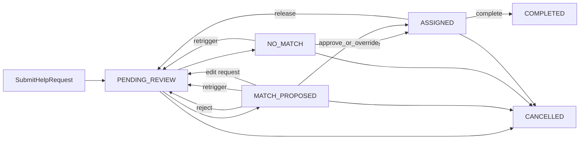

# Product & System Specification: KindBridge

Course mapping: a civic-aid request is the "open job"; proposed/assigned volunteers are the "registrants" on the dashboard (functional requirement 4.4).

> **Revision note (v1.1).** Identity is separated from roles: `users` is the person, and extensions (`volunteer_profiles`, `requester_profiles`) hang off it by `user_id`. A person can be both a requester and a volunteer. Items marked **[NEW]** or **[CHANGED]** differ from v1.0. Items marked **[DEFERRED]** are documented but not built in v1.

---

## 1. Overview and objectives

KindBridge coordinates citizen assistance requests, volunteer capacity, and AI-assisted matching. A background Deep Agent evaluates records; a human dispatcher always approves, rejects, or overrides (HITL). The agent never assigns contact details or locks a volunteer by itself.

### Locked product decisions

- Product name: **KindBridge** (not AidSync).
- Matching: **top-K = 3** proposed volunteers per request, then the dispatcher picks one.
- Volunteer consent after assignment: the volunteer may **release** (cannot perform); there is no separate pre-accept step in v1.
- **[CHANGED] Identity and roles:** one account = one person (`users` row). Roles are **derived**, not stored as a column:
  - `ADMIN` if `users.is_admin = 1`. Admin is **exclusive**: an admin account cannot submit requests and cannot volunteer.
  - `REQUESTER` for every non-admin user.
  - `VOLUNTEER` for a non-admin user with an enabled `volunteer_profiles` row.
  - A person may therefore hold `REQUESTER` and `VOLUNTEER` together.
- **[NEW] Self-assignment is forbidden:** a volunteer can never be proposed, approved, or overridden onto a request they created (`volunteer_profiles.user_id = help_requests.requester_id`). Enforced by one shared function (`is_self_assignment`) called from the agent filter, `ApproveAssignmentCommand`, and `OverrideAssignmentCommand`.
- Relational dialect: **Microsoft SQL Server** on Somee.com. Vector store is **ChromaDB**, not pgvector.
- Application server: **Flask**, organized as CQRS/MVC (see [architecture.md](architecture.md)).

### Primary objectives

- Track the full lifecycle of a help request.
- Semantic candidate evaluation (embeddings + RAG) plus deterministic hard constraints.
- Admin dashboard: open requests by status, candidate count per request, volunteer capacity gauges.
- Enforce inactivity, logistical capacity, schedule overlap (with a parallel-task exception), geography, unavailability periods, and mutual exemptions.

---

## 2. Authentication and identity

- **Mechanism:** JWT in HttpOnly, Secure, SameSite=Lax cookies. Access token TTL 60 minutes; no refresh tokens in v1 (the user logs in again on expiry). CSRF: double-submit cookie on mutating POST/PUT/PATCH/DELETE.
- **Password:** bcrypt (cost >= 12). Minimum 10 characters. No plaintext logs.
- **[CHANGED] RBAC:** the JWT carries `roles` as a **list** (e.g. `["REQUESTER","VOLUNTEER"]`), computed at login from `is_admin` and the volunteer profile. Every command and query checks that the list contains a role allowed for the action. Unauthorized -> 401; forbidden -> 403. If a person enables or disables the volunteer profile, the roles list refreshes on the next login (or on re-issue of the cookie after the command succeeds).
- **Bootstrap:** the first admin is created by a one-time seed (`ADMIN_BOOTSTRAP_EMAIL` in environment), not via public registration. Admin status is never granted or removed through the app.
- **Forgot-password:** out of scope for v1. Failed login lockout: 5 attempts / 15 minutes per email, tracked in the non-event-sourced `login_attempts` table.

### Personas

| Role | How obtained | Can do | Cannot do |
| :--- | :--- | :--- | :--- |
| Requester | Every public registration | Create/cancel/edit (before assignment) own requests; search/filter/detail **own** tickets; maintain own requester profile | See volunteer phone/address until `ASSIGNED`; see other requesters' tickets |
| Volunteer | Enable volunteer profile (at registration or later) | Edit own profile; add/cancel unavailability periods; see **assigned** tasks; complete or release | See other volunteers; see full address until assigned; be assigned to own request |
| Admin / dispatcher | Seed only; exclusive | Dashboard, search all, approve/reject/override, retrigger match, reclassify concurrency, manage exemptions | Impersonate login; submit requests; volunteer |

---

## 3. Core entities (SQL Server projections)

The source of truth for domain changes is the **event store** (see [event-sourcing.md](event-sourcing.md)). Tables below are **read models** rebuilt from events, except `events` and `login_attempts`. Types are T-SQL. JSON arrays are stored as `NVARCHAR(MAX)` (`["first_aid","driving"]`).

### Entity map

```
users  (the person)
  |-- 0..1  volunteer_profiles      (extension: person volunteers)
  |-- 0..1  requester_profiles      (extension: saved defaults for a person who needs help)
  |-- 0..N  help_requests           (requester_id)
  |-- N..M  exemption_links         (volunteer user <-> requester user)

volunteer_profiles
  |-- 0..N  volunteer_unavailability
  |-- 0..N  task_assignments

help_requests
  |-- 0..N  task_assignments
  |-- 0..1  request_series          (series_id, optional)

events (event store)  |  login_attempts (lockout)
```

### 3.1 `users` [CHANGED]

| Field | Type | Constraints | Description |
| :--- | :--- | :--- | :--- |
| `id` | UNIQUEIDENTIFIER | PK | User id |
| `email` | NVARCHAR(255) | UNIQUE, NOT NULL | Login identifier (normalized lower-case) |
| `password_hash` | NVARCHAR(255) | NOT NULL | bcrypt hash; comes from the `CredentialSet` event |
| `full_name` | NVARCHAR(200) | NOT NULL | Display name |
| `phone` | NVARCHAR(400) | NOT NULL | Encrypted (app-level); ciphertext is longer than the plain number, hence 400 |
| `is_admin` | BIT | NOT NULL, default 0 | **Replaces `role`.** Exclusive admin flag |
| `is_active` | BIT | NOT NULL, default 1 | Soft disable |
| `created_at` | DATETIME2 | NOT NULL | UTC |

There is no `role` column. See section 2 for how roles are derived.

### 3.2 `requester_profiles` [NEW]

Optional 1:1 extension. Holds data that repeats across a person's requests, so they do not retype it. A user without a row is still a valid requester.

| Field | Type | Constraints | Description |
| :--- | :--- | :--- | :--- |
| `id` | UNIQUEIDENTIFIER | PK | Profile id |
| `user_id` | UNIQUEIDENTIFIER | UNIQUE, FK users, NOT NULL | 1:1 with the user |
| `default_city` | NVARCHAR(100) | NULL | Pre-fills the request form |
| `default_address` | NVARCHAR(255) | NULL | Pre-fills the request form; same visibility rules as `help_requests.address` |
| `accessibility_notes` | NVARCHAR(500) | NULL | e.g. mobility limits; shown to the **assigned** volunteer only and included in the matching text |
| `emergency_contact_name` | NVARCHAR(200) | NULL | Contact for emergencies |
| `emergency_contact_phone` | NVARCHAR(400) | NULL | Encrypted (app-level) |
| `updated_at` | DATETIME2 | NOT NULL | UTC |

### 3.3 `volunteer_profiles` [CHANGED]

`experience` + `skills_json` are the **resume document** embedded into ChromaDB (NFR 6). Re-embed on every successful `UpdateVolunteerProfileCommand` and on enable.

| Field | Type | Constraints | Description |
| :--- | :--- | :--- | :--- |
| `id` | UNIQUEIDENTIFIER | PK | Profile id |
| `user_id` | UNIQUEIDENTIFIER | UNIQUE, FK users, NOT NULL | 1:1 with the user |
| `is_enabled` | BIT | NOT NULL, default 1 | **[NEW]** Volunteer role switch. Disabling keeps all data |
| `primary_city` | NVARCHAR(100) | Indexed, NOT NULL | Home municipality |
| `has_vehicle` | BIT | NOT NULL, default 0 | Transport available |
| `skills_json` | NVARCHAR(MAX) | NOT NULL | JSON string array |
| `experience` | NVARCHAR(MAX) | NOT NULL | Resume narrative |
| `base_frequency` | NVARCHAR(30) | NOT NULL | `WEEKLY`, `BIWEEKLY`, `MONTHLY`, `ON_DEMAND` (one-off / as needed). **Soft** score bonus, never a hard filter |
| `availability_status` | NVARCHAR(30) | NOT NULL, default `AVAILABLE` | Stored values: `AVAILABLE`, `INACTIVE`. See availability rules |
| `max_active_tasks` | INT | NOT NULL, default 1 | **[CHANGED]** Cap for `EXCLUSIVE` tasks |
| `max_parallel_tasks` | INT | NOT NULL, default 2 | **[NEW]** Cap for `PARALLEL_OK` tasks. 0 = "I do not want parallel tasks" |
| `current_active_tasks` | INT | NOT NULL, default 0 | **Projection**: `ASSIGNED` `EXCLUSIVE` tasks. Never written by a query |
| `current_parallel_tasks` | INT | NOT NULL, default 0 | **[NEW]** Projection: `ASSIGNED` `PARALLEL_OK` tasks |

`unavailable_until` from v1.0 is **removed**; unavailability periods now live in `volunteer_unavailability` (3.4).

**Availability rules**

- `INACTIVE`: set by the volunteer toggle only in v1 (automatic 90-day inactivity is deferred). The agent skips `INACTIVE`.
- `TEMPORARILY_UNAVAILABLE` is a **derived display value**: it applies when an active `volunteer_unavailability` period covers today. No scheduler; eligibility is evaluated lazily at match time.
- `BUSY` is a derived display value: `current_active_tasks >= max_active_tasks`.
- The agent skips a volunteer if `has_vehicle = 0` and the request has `requires_vehicle = 1`.
- A volunteer with `is_enabled = 0` is never matched, and their existing tasks follow the rules in section 4.3.

### 3.4 `volunteer_unavailability` [NEW]

Date ranges when a volunteer cannot help. A volunteer may have many.

| Field | Type | Constraints | Description |
| :--- | :--- | :--- | :--- |
| `id` | UNIQUEIDENTIFIER | PK | Period id |
| `volunteer_id` | UNIQUEIDENTIFIER | FK volunteer_profiles, NOT NULL | Volunteer |
| `from_date` | DATE | NOT NULL | Start (inclusive) |
| `until_date` | DATE | NOT NULL, `>= from_date` | End (inclusive) |
| `reason` | NVARCHAR(200) | NULL | Internal note, never shown to requesters |
| `is_cancelled` | BIT | NOT NULL, default 0 | Soft cancel |
| `created_at` | DATETIME2 | NOT NULL | UTC |

A volunteer is excluded when the request's `preferred_date` falls inside a non-cancelled period. If the request has no `preferred_date`, today's date is used. Adding a period that covers the date of an `ASSIGNED` task is rejected with 409 until the task is released.

### 3.5 `help_requests` [CHANGED]

| Field | Type | Constraints | Description |
| :--- | :--- | :--- | :--- |
| `id` | UNIQUEIDENTIFIER | PK | Ticket id |
| `requester_id` | UNIQUEIDENTIFIER | FK users, NOT NULL | Owner. Can be a person who is also a volunteer |
| `series_id` | UNIQUEIDENTIFIER | FK request_series, NULL | **[NEW] [DEFERRED]** NULL = one-off request |
| `city` | NVARCHAR(100) | Indexed, NOT NULL | Municipality |
| `address` | NVARCHAR(255) | NOT NULL | Street address; hidden from volunteer until assignment |
| `category` | NVARCHAR(50) | NOT NULL | Aid domain (enum in app; list defined in architecture.md) |
| `resource_type` | NVARCHAR(30) | NOT NULL | `PHYSICAL_PRESENCE`, `EQUIPMENT_LOAN`, `FLEXIBLE_REMOTE` |
| `description` | NVARCHAR(MAX) | NOT NULL | Narrative of need |
| `urgency` | NVARCHAR(20) | NOT NULL | `LOW`, `NORMAL`, `HIGH`, `EMERGENCY` |
| `preferred_date` | DATE | NULL | Target date |
| `preferred_time_from` | TIME | NULL | Window start |
| `preferred_time_to` | TIME | NULL | Window end |
| `estimated_duration_min` | INT | NULL | Duration in minutes (used when no window is given) |
| `required_skills_json` | NVARCHAR(MAX) | NOT NULL | JSON string array |
| `requires_vehicle` | BIT | NOT NULL, default 0 | True only if transport is required; independent of `resource_type` |
| `concurrency_type` | NVARCHAR(20) | NOT NULL, default `UNKNOWN` | **[NEW]** `EXCLUSIVE`, `PARALLEL_OK`, `UNKNOWN`. See 4.4 |
| `status` | NVARCHAR(30) | Indexed, NOT NULL | See request state machine |
| `match_attempt` | INT | NOT NULL, default 0 | Incremented each ProposeMatch; used for idempotency |
| `created_at` | DATETIME2 | NOT NULL | UTC |

`requires_vehicle` is the vehicle flag. `resource_type` is how the work is delivered (on-site vs remote vs equipment). Do not duplicate `EQUIPMENT_VEHICLE`.

### 3.6 `request_series` [NEW] [DEFERRED]

Reserved for recurring requests. In v1 no UI or command creates a series and `help_requests.series_id` stays NULL. Each occurrence of a future series is an ordinary `help_requests` row with its own lifecycle, so the state machine does not change.

| Field | Type | Constraints | Description |
| :--- | :--- | :--- | :--- |
| `id` | UNIQUEIDENTIFIER | PK | Series id |
| `requester_id` | UNIQUEIDENTIFIER | FK users, NOT NULL | Requester |
| `recurrence` | NVARCHAR(20) | NOT NULL | `WEEKLY`, `BIWEEKLY`, `MONTHLY` |
| `start_date` | DATE | NOT NULL | First occurrence |
| `end_date` | DATE | NULL | NULL = open-ended |
| `preferred_volunteer_id` | UNIQUEIDENTIFIER | FK volunteer_profiles, NULL | Soft score bonus for continuity, never a lock |
| `is_active` | BIT | NOT NULL, default 1 | Stop the series |

### 3.7 `task_assignments`

Multiple rows per request (up to K proposals). At most **one** row in `ASSIGNED` or `COMPLETED` per request (filtered unique index).

| Field | Type | Constraints | Description |
| :--- | :--- | :--- | :--- |
| `id` | UNIQUEIDENTIFIER | PK | Assignment id |
| `request_id` | UNIQUEIDENTIFIER | FK help_requests, NOT NULL | Parent ticket |
| `volunteer_id` | UNIQUEIDENTIFIER | FK volunteer_profiles, NOT NULL | Candidate |
| `ai_score` | DECIMAL(5,2) | NULL, 0.00-100.00 | KindBridge score; NULL for a manual override |
| `ai_rationale` | NVARCHAR(500) | NULL | Short justification; NULL for a manual override |
| `rank_in_batch` | INT | NULL | 1..K in this match_attempt; NULL for a manual override |
| `match_attempt` | INT | NOT NULL | Ties to request.match_attempt |
| `approved_by` | UNIQUEIDENTIFIER | NULL, FK users | Dispatcher |
| `status` | NVARCHAR(30) | NOT NULL | `PROPOSED`, `ASSIGNED`, `DECLINED`, `COMPLETED`, `SUPERSEDED` |
| `decline_reason` | NVARCHAR(500) | NULL | Reject, release, or override leftover |
| `override_reason` | NVARCHAR(500) | NULL | Required on override |
| `updated_at` | DATETIME2 | NOT NULL | UTC |

`current_active_tasks` and `current_parallel_tasks` count only `ASSIGNED` rows (never `COMPLETED`), split by the request's `concurrency_type`.

### 3.8 `exemption_links` [CHANGED]

| Field | Type | Constraints | Description |
| :--- | :--- | :--- | :--- |
| `volunteer_id` | UNIQUEIDENTIFIER | Composite PK, FK **users** | Excluded volunteer (user id, consistent with `requester_id`) |
| `requester_id` | UNIQUEIDENTIFIER | Composite PK, FK users | Requester |
| `created_by` | UNIQUEIDENTIFIER | FK users, NOT NULL | Admin or volunteer |
| `reason` | NVARCHAR(300) | NOT NULL | Why |
| `created_at` | DATETIME2 | NOT NULL | UTC |

Permanent for v1 (no undelete UI). Creating a link while an assignment is `ASSIGNED` is rejected; cancel or release first.

### 3.9 `events` (event store) [NEW definition]

The source of truth. All tables above except `login_attempts` are rebuilt from it.

| Field | Type | Constraints | Description |
| :--- | :--- | :--- | :--- |
| `event_id` | UNIQUEIDENTIFIER | PK | Event id |
| `stream_id` | UNIQUEIDENTIFIER | NOT NULL | Aggregate id (user or help request) |
| `stream_type` | NVARCHAR(50) | NOT NULL | `User`, `HelpRequest` |
| `version` | INT | NOT NULL | Sequence within the stream |
| `event_type` | NVARCHAR(100) | NOT NULL | e.g. `HelpRequestCreated` |
| `payload` | NVARCHAR(MAX) | NOT NULL | JSON |
| `occurred_at` | DATETIME2 | NOT NULL | UTC |

Constraint: `UNIQUE (stream_id, version)` gives optimistic concurrency; a concurrent writer gets 409. Volunteer profile, requester profile, and unavailability events live in the **User** stream (same person).

### 3.10 `login_attempts` (not event-sourced) [NEW definition]

| Field | Type | Constraints | Description |
| :--- | :--- | :--- | :--- |
| `id` | BIGINT | PK, IDENTITY | Row id |
| `email` | NVARCHAR(255) | Indexed, NOT NULL | Email attempted |
| `attempted_at` | DATETIME2 | NOT NULL | UTC |
| `succeeded` | BIT | NOT NULL | Result |

Lockout: 5 failures within 15 minutes for the same email.

---

## 4. Matching rules and state machines

### 4.1 Help request status

`PENDING_REVIEW` -> `MATCH_PROPOSED` | `NO_MATCH`; `MATCH_PROPOSED` -> `ASSIGNED` -> `COMPLETED`; `NO_MATCH` -> `PENDING_REVIEW` (retrigger) or `ASSIGNED` (override).
`ASSIGNED` -> `PENDING_REVIEW` when the volunteer releases.
Any of `PENDING_REVIEW`, `MATCH_PROPOSED`, `NO_MATCH`, `ASSIGNED` -> `CANCELLED`.



| Current | Command | Event | Next | Invariants |
| :--- | :--- | :--- | :--- | :--- |
| - | `RegisterUserCommand` | `UserRegistered` (+ `VolunteerProfileEnabled` if the form includes a volunteer profile) | (user exists) | No role in payload. `is_admin` is never set here |
| - | `LoginCommand` | `UserLoggedIn` | - | Audit only; no domain status |
| - | `SubmitHelpRequestCommand` | `HelpRequestCreated` | `PENDING_REVIEW` | Non-admin only; enqueue agent |
| `PENDING_REVIEW`, `NO_MATCH`, `MATCH_PROPOSED` | `UpdateHelpRequestCommand` | `HelpRequestUpdated` | `PENDING_REVIEW` | **[NEW]** Owner only. Not allowed once `ASSIGNED` (cancel and recreate). Open `PROPOSED` rows -> `SUPERSEDED`; concurrency type reclassified; agent re-queued |
| `PENDING_REVIEW` | `ClassifyConcurrencyCommand` | `ConcurrencyClassified` | (unchanged) | **[NEW]** Agent or admin. See 4.4 |
| `PENDING_REVIEW` | `ProposeMatchCommand` | `MatchesProposed` | `MATCH_PROPOSED` | Agent only; writes 1..K `PROPOSED` rows; increments `match_attempt`; applies the hard filter in 4.2 |
| `PENDING_REVIEW` | `ProposeMatchCommand` (empty pool) | `NoMatchFound` | `NO_MATCH` | Admin notified; no assignment rows; payload carries the **rejection summary** (counts per filter reason) |
| `NO_MATCH` or `MATCH_PROPOSED` | `RetriggerMatchCommand` | `MatchRetriggered` | `PENDING_REVIEW` | Admin; previous `PROPOSED` -> `SUPERSEDED` |
| `MATCH_PROPOSED` | `ApproveAssignmentCommand` | `AssignmentApproved` | `ASSIGNED` | Admin; fails if `is_self_assignment` or the volunteer no longer passes the capacity/overlap checks; chosen assignment -> `ASSIGNED`; siblings -> `SUPERSEDED`; increment the matching volunteer counter; Gmail notify volunteer (and requester); expose address/phone to that volunteer only |
| `MATCH_PROPOSED` | `RejectAssignmentCommand` | `AssignmentsRejected` | `PENDING_REVIEW` | Admin; **all** current `PROPOSED` -> `DECLINED` with reason; those volunteers blacklisted for **this request only**; re-queue agent |
| `NO_MATCH` or `MATCH_PROPOSED` | `OverrideAssignmentCommand` | `AssignmentOverridden` | `ASSIGNED` | Admin picks any volunteer who passes the hard filter (including `is_self_assignment`); `override_reason` required; creates an `ASSIGNED` row with NULL score, rationale, rank; current `PROPOSED` -> `SUPERSEDED`; counter + notify |
| `ASSIGNED` | `CompleteTaskCommand` | `TaskCompleted` | `COMPLETED` | Assigned volunteer only; decrement counter; request terminal |
| `ASSIGNED` | `ReleaseTaskCommand` | `TaskReleased` | `PENDING_REVIEW` | Assigned volunteer; assignment -> `DECLINED`; volunteer blacklisted on this request; decrement counter; re-queue; notify requester |
| Open states | `CancelRequestCommand` | `HelpRequestCancelled` | `CANCELLED` | Owner (or admin); if `ASSIGNED`, notify volunteer via Gmail and free capacity; open proposals -> `SUPERSEDED` |

**Concurrency control:** optimistic version on the request aggregate (`match_attempt` + event stream version). A second approve/override fails with 409.

**Past `preferred_date`:** still matchable; the agent adds a score penalty; the dashboard shows an `OVERDUE` badge. `EMERGENCY` uses a higher urgency weight (see [agent-and-mcp.md](agent-and-mcp.md)), not a separate queue. For a real medical emergency the UI shows a notice to call the national emergency number; KindBridge is not an emergency service.

### 4.2 Hard filter (deterministic, not LLM)

Stage 1 of `ProposeMatchCommand`. It runs as plain code (a SQL query / MCP tool), so results are reproducible and testable. A volunteer failing **any** check is excluded.

| # | Check | Excluded when |
| :--- | :--- | :--- |
| 1 | Role active | `volunteer_profiles.is_enabled = 0`, `users.is_active = 0`, or `availability_status = INACTIVE` |
| 2 | Not the same person | `volunteer_profiles.user_id = help_requests.requester_id` |
| 3 | Exemption | An `exemption_links` row exists for the volunteer user and the requester |
| 4 | Declined before | The volunteer has a `DECLINED` assignment on this request (reject or release) |
| 5 | Unavailability | `preferred_date` (or today) falls inside a non-cancelled `volunteer_unavailability` period |
| 6 | Geography | `resource_type` is `PHYSICAL_PRESENCE` or `EQUIPMENT_LOAN` and `volunteer.primary_city <> request.city`. `FLEXIBLE_REMOTE` ignores city. (v1 uses exact city match; a radius is deferred) |
| 7 | Vehicle | `requires_vehicle = 1` and `has_vehicle = 0` |
| 8 | Capacity | Per the concurrency rules in 4.4 |
| 9 | Schedule overlap | Per the concurrency rules in 4.4 |

`SUPERSEDED` rows are leftover proposals, not a blacklist. The filter also records **why** each volunteer was excluded (counts per check) in the `NoMatchFound` payload so the dispatcher sees what is missing before deciding on an override.

### 4.3 Changes after assignment

- **Volunteer adds an unavailability period over an `ASSIGNED` task, or sets `INACTIVE`, or disables the profile:** rejected with 409 while they hold an `ASSIGNED` task; they must release first.
- **Requester edits an `ASSIGNED` request:** not allowed; cancel and resubmit.
- **User is deactivated (`is_active = 0`):** open requests they own are cancelled; tasks they hold are released.

### 4.4 Concurrency (parallel tasks)

Some tasks can run alongside others (a short phone check-in) and some cannot (accompanying someone to a doctor). The **agent classifies**; the result is **stored** so the hard filter stays deterministic.

| `concurrency_type` | Meaning | Typical |
| :--- | :--- | :--- |
| `EXCLUSIVE` | Needs full presence/attention | Escort, shopping, physical help at home |
| `PARALLEL_OK` | Can run beside other tasks | Remote call, short equipment drop-off |
| `UNKNOWN` | Not yet classified | Treated as `EXCLUSIVE` by the filter |

**Classification.** `ClassifyConcurrencyCommand` is called by the agent at the start of `ProposeMatch` when the value is `UNKNOWN`, and may be called by an admin to override. Defaults: `FLEXIBLE_REMOTE` leans `PARALLEL_OK`, `PHYSICAL_PRESENCE` leans `EXCLUSIVE`; the agent deviates only with a reason from the description. The reasoning is stored in the `ConcurrencyClassified` event payload, not in a table column.

**Capacity (check 8).**
- `EXCLUSIVE` request: `current_active_tasks < max_active_tasks`.
- `PARALLEL_OK` request: `current_parallel_tasks < max_parallel_tasks`.

**Overlap (check 9).** Two tasks of the same volunteer may overlap in time only if **both** are `PARALLEL_OK`.
- With time windows (`preferred_time_from/to`, or `estimated_duration_min` from a start time): compare the intervals on the same date.
- Without a window: two `EXCLUSIVE` tasks on the same date are treated as overlapping; a `PARALLEL_OK` task is not blocked by date alone.

### 4.5 Assignment status

`PROPOSED` -> `ASSIGNED` | `DECLINED` | `SUPERSEDED`
`ASSIGNED` -> `COMPLETED` | `DECLINED` (on release/cancel)

### 4.6 Scoring (stage 2, soft)

Only volunteers who passed 4.2 are ranked. Inputs: semantic similarity between the request text (description + requester accessibility notes) and the volunteer resume (ChromaDB); required-skill coverage; `base_frequency` bonus; continuity bonus (series, deferred); urgency weight; overdue penalty. Top **3** become `PROPOSED` with `ai_score` and `ai_rationale`. Details in [agent-and-mcp.md](agent-and-mcp.md).

---

## 5. Commands and queries (complete list)

**Commands:**
`RegisterUserCommand`, `LoginCommand`,
`EnableVolunteerProfileCommand` [NEW], `UpdateVolunteerProfileCommand`, `DisableVolunteerProfileCommand` [NEW],
`AddVolunteerUnavailabilityCommand` [NEW], `CancelVolunteerUnavailabilityCommand` [NEW],
`UpdateRequesterProfileCommand` [NEW],
`SubmitHelpRequestCommand`, `UpdateHelpRequestCommand` [NEW], `CancelRequestCommand`,
`ClassifyConcurrencyCommand` [NEW] (agent/admin),
`ProposeMatchCommand` (agent), `RetriggerMatchCommand`, `ApproveAssignmentCommand`, `RejectAssignmentCommand`, `OverrideAssignmentCommand`,
`CompleteTaskCommand`, `ReleaseTaskCommand`,
`CreateExemptionLinkCommand`.

`SetVolunteerAvailabilityCommand` from v1.0 is replaced by the INACTIVE toggle inside `UpdateVolunteerProfileCommand` plus the two unavailability commands.

**Queries:**
`GetAdminDashboardQuery`, `SearchHelpRequestsQuery` (role-scoped filters: category, city, urgency, status), `GetHelpRequestDetailsQuery`, `GetVolunteerTasksQuery`, `GetMyRequestsQuery`, `GetMyProfilesQuery` [NEW] (requester + volunteer profiles and unavailability), `GetVolunteerDirectoryQuery` (admin), `GetAssignmentCandidatesQuery`.

**Events (new or changed in v1.1):** `UserRegistered` (no role), `VolunteerProfileEnabled`, `VolunteerProfileUpdated`, `VolunteerProfileDisabled`, `VolunteerUnavailabilityAdded`, `VolunteerUnavailabilityCancelled`, `RequesterProfileUpdated`, `HelpRequestUpdated`, `ConcurrencyClassified`. Payload definitions go in [event-sourcing.md](event-sourcing.md).

---

## 6. User workflows (course 4.1-4.5)

1. **Data entry:** register (optionally with a volunteer profile); a requester creates a ticket; a volunteer submits profile/resume fields and unavailability periods.
2. **Search:** filters on category, city, urgency, status (requester: own rows; admin: all; volunteer: assigned tasks).
3. **Table:** queues, candidates per ticket, history.
4. **Detail:** narrative, scoped location, AI score breakdown for each of the K candidates, concurrency type, exclusion summary when `NO_MATCH`.
5. **Dashboard (4.4):** open requests by status; **count of proposed + assigned candidates per request**; volunteer gauges Available / Busy / Inactive.

A person with both roles sees a role switcher ("I need help" / "I volunteer") in the UI. Screen-level UI is in [ui-ux.md](ui-ux.md). Tests for edges are in [test-plan.md](test-plan.md).

---

## 7. Out of scope for v1 (documented, not built)

| Item | Note |
| :--- | :--- |
| Recurring requests (`request_series`) | Table reserved; `series_id` stays NULL |
| Weekly availability slots (e.g. "Tuesday afternoons only") | Possible `volunteer_availability_slots` in v2 |
| Capacity checked per date | v1 uses current counters; revisit with recurring requests |
| Geographic radius | v1 uses exact city match |
| Stuck proposals / tasks (timeouts, reminders, task-level `OVERDUE`) | v2 |
| No-show handling, reopening a `COMPLETED` request | v2 |
| Feedback / rating of volunteers | v2 |
| Requester notifications beyond the events listed in 4.1 | v2 |
| Account deletion and privacy (crypto-shredding of personal data in events) | Needs a design decision before production |
| Hebrew embedding quality | Choose and test a multilingual embedding model before relying on semantic scores |
| Forgot-password, refresh tokens, 90-day auto-inactivity | v2 |

---

## 8. Files to update for consistency

When this version is adopted, search every document and rule for the old assumption (`role` as a column, "role immutable", "one role per account") and update:

| File | Change |
| :--- | :--- |
| `event-sourcing.md` | New and changed events (section 5); profile and unavailability events in the User stream |
| `architecture.md` | Flask + CQRS/MVC layout; `roles` list in JWT; shared `is_self_assignment`; category enum; MCP tools (see below) |
| `agent-and-mcp.md` | Two-stage matching (4.2 deterministic filter as an MCP tool, 4.6 scoring), concurrency classification, Tavily web search, Gmail MCP |
| `rules-and-skills.md`, `.cursor/rules/kindbridge-cqrs.mdc` | Role checks use the roles list; no writes from queries; filter code stays deterministic |
| `test-plan.md` | Volunteer submits own request; self-assignment blocked in propose/approve/override; admin cannot submit; unavailability covering the request date; city mismatch; parallel vs exclusive overlap; edit-after-proposal supersedes; 409 on adding unavailability over an assigned task |
| `ui-ux.md` | Role switcher; requester profile screen; unavailability management; exclusion summary on `NO_MATCH` |